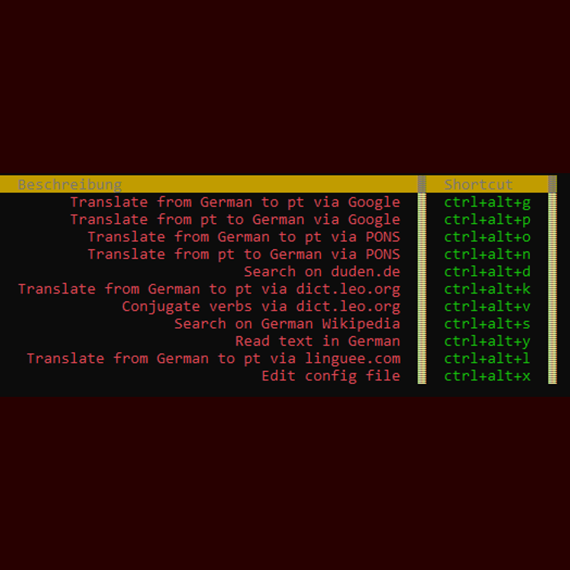
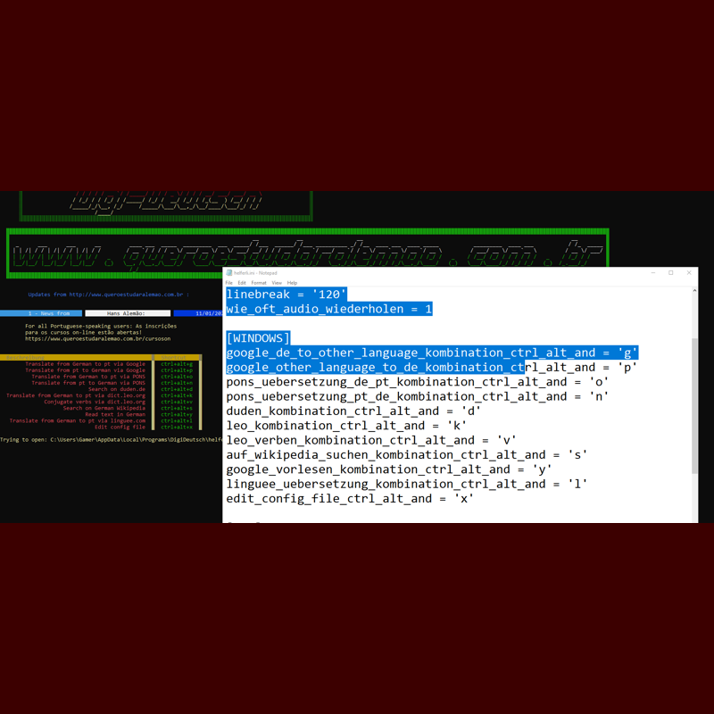
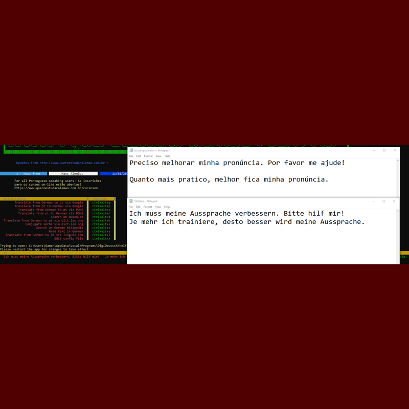
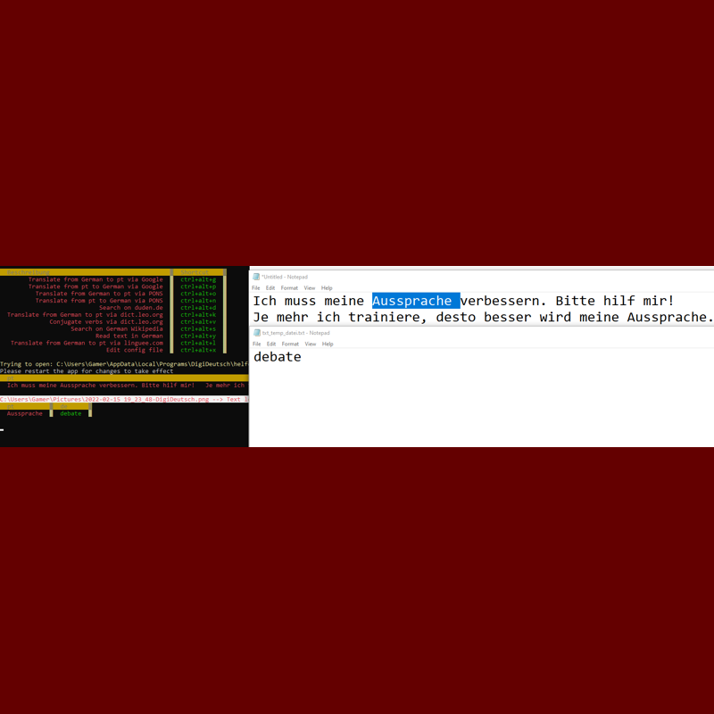
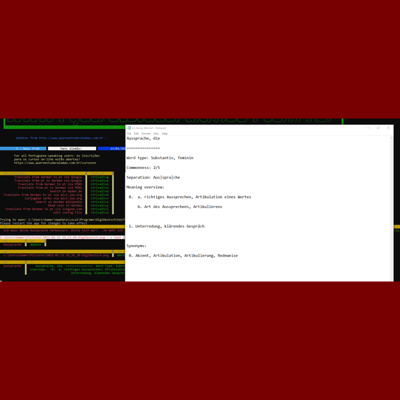
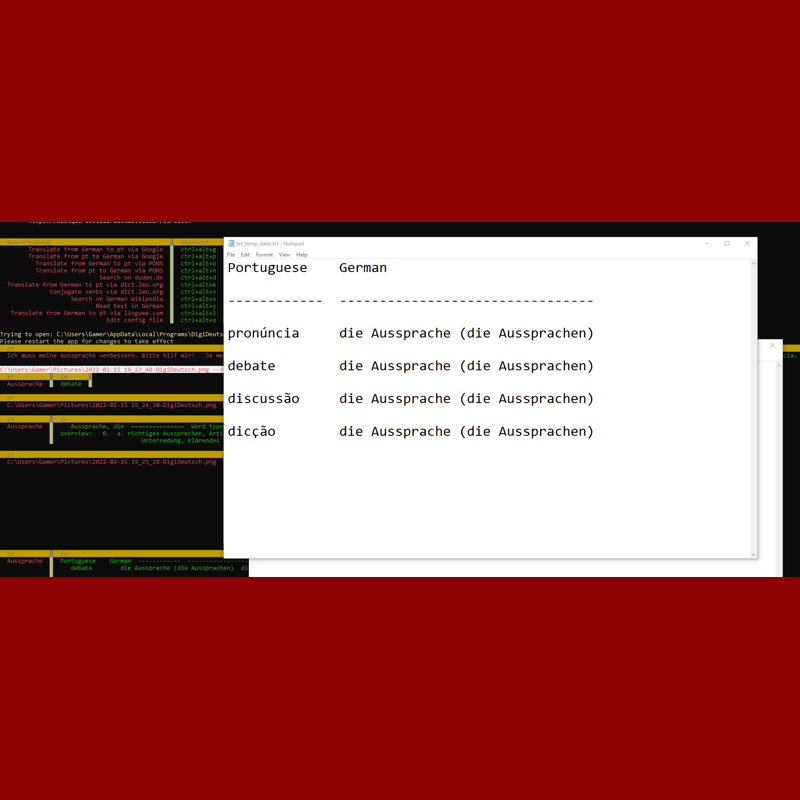
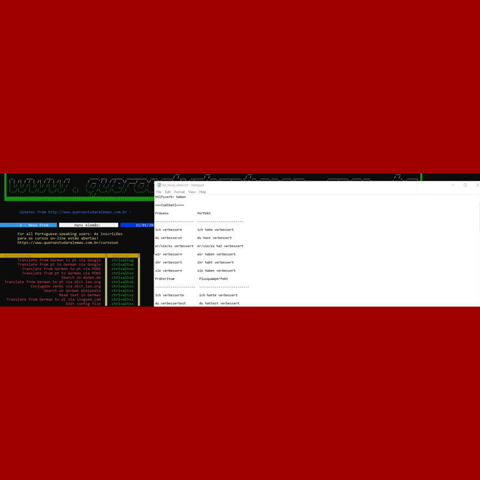
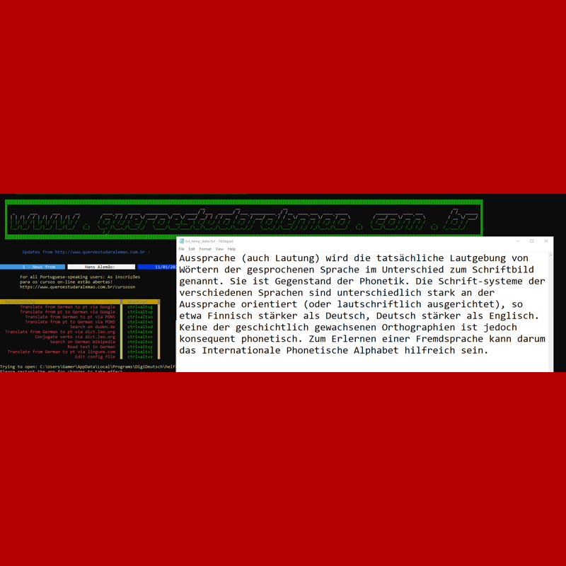
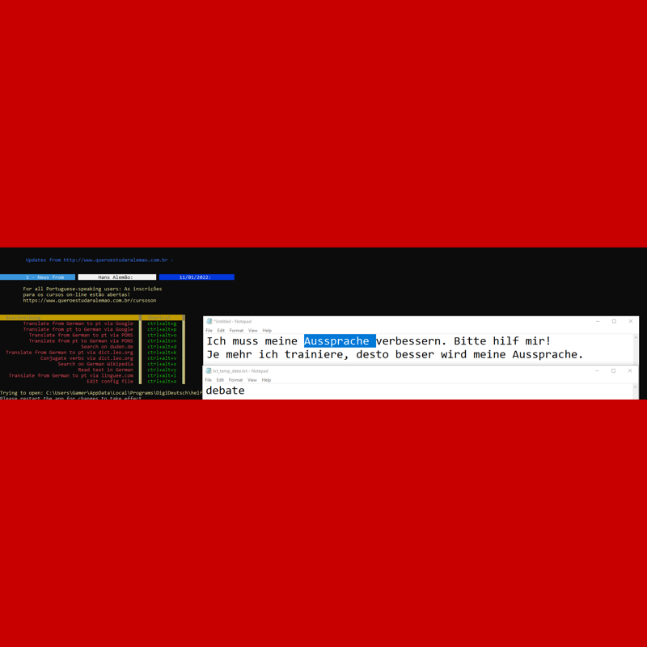

<p align="center"><a href="https://twitter.com/Aprender_alemao"></a><a href="https://www.facebook.com/estudaralemao/"></a><a href="https://www.instagram.com/estudaralemao/"></a><a href="https://www.youtube.com/c/wwwqueroestudaralemaocombr"></a><a href="https://api.whatsapp.com/send?phone=5511989782756&text=I%20want%20to%20know%20..."></a><a href="https://www.queroestudaralemao.com.br"></a><a href="https://br.pinterest.com/chucrutehans/"></a><a href="mailto:aulasparticularesdealemaosp@gmail.com?subject=I%20want%20to%20know%20...%20">
</a>

<a href="https://www.queroestudaralemao.com.br"></a></p>

<p align="center">
<a href=https://github.com/hansalemaos></a>
<a href=https://www.queroestudaralemao.com.br></a>
<a href=#></a>
<a href=#></a>
<a href=#></a>
<a href=https://codeload.github.com/liangjingkanji/DrakeTyporaTheme/zip/refs/heads/master></a>
<a href=https://github.com/dmhendricks/signature-social-icons></a>
</p><br>


# DigiDeutsch


## What can you do with it?

- Look up/translate words using keyboard shortcuts
- Configure your own shortcuts
- Google Translator, PONS, Duden, dict.leo.org, Wikipedia, Google Speech to Text, Linguee
- Output as txt file, opened with notepad.exe
- No coding required!
- Download,install and start
- Source code included!
- For Windows!

## How to install/run?

### Tutorial and things you have to know:

| _,.-'``'-.,_,.'`` Step 1 ``'.,_,.-'``'-.,_|Screenshot|
| -------------------------------------------------------------- |- |
DigiDeutsch is a tool that allows you looking up/translating words by<br>copying them to the clipboard and pressing a key combination.<br>ATTENTION: SINCE THIS APP IS READING THE CLIPBOARD, YOUR<br>ANTIVIRUS (e.g. Avira) MAY  GIVE YOU A FALSE ALARM!| |

| _,.-'``'-.,_,.'`` Step 2 ``'.,_,.-'``'-.,_|Screenshot|
| -------------------------------------------------------------- |- |
Here is an overview of everything you can do with DigiDeutsch| |

| _,.-'``'-.,_,.'`` Step 3 ``'.,_,.-'``'-.,_|Screenshot|
| -------------------------------------------------------------- |- |
If you want to change the key combinations, press CTRL+ALT+X After you<br>have edited the file, close it and restart the app.| |

| _,.-'``'-.,_,.'`` Step 4 ``'.,_,.-'``'-.,_|Screenshot|
| -------------------------------------------------------------- |- |
Here I translated a German text in the clipboard to Portuguese using<br>the "Translate from German to pt via Google". By the way, since I am a<br>German living in Brazil, the standard translation language is<br>Portuguese. If you want to change it to English, you have to edit the source code.| |

| _,.-'``'-.,_,.'`` Step 5 ``'.,_,.-'``'-.,_|Screenshot|
| -------------------------------------------------------------- |- |
Here I used the "Translate from German to pt via PONS".** Attention: this option accepts only one word.**| |

| _,.-'``'-.,_,.'`` Step 6 ``'.,_,.-'``'-.,_|Screenshot|
| -------------------------------------------------------------- |- |
Here I copied a word to the clipboard and searched for it on<br>https://duden.de **Be careful: you can look up only one single word using this option**| |

| _,.-'``'-.,_,.'`` Step 7 ``'.,_,.-'``'-.,_|Screenshot|
| -------------------------------------------------------------- |- |
Here I copied a word to the clipboard and looked it up on<br>https://dict.leo.org **Be careful: you can look up only one single word using this option**| |

| _,.-'``'-.,_,.'`` Step 8 ``'.,_,.-'``'-.,_|Screenshot|
| -------------------------------------------------------------- |- |
You can also look up the conjugation table of a verb on<br>https://dict.leo.org (one verb at the time)| |

| _,.-'``'-.,_,.'`` Step 9 ``'.,_,.-'``'-.,_|Screenshot|
| -------------------------------------------------------------- |- |
Here is the result of a Wikipedia look up **(one word at the time)**| |

| _,.-'``'-.,_,.'`` Step 10 ``'.,_,.-'``'-.,_|Screenshot|
| -------------------------------------------------------------- |- |
You can also look up words on https://www.linguee.com **(one word at the time)**| |


## License

```
GNU AFFERO GENERAL PUBLIC LICENSE
```

## Donations 

If this project has helped you somehow, consider donating a small amount. After being absent from computer programming for more than 20 years, I started again this year. At the beginning of 2021, I suffered from a bone infection and had to spend more than 3 months in hospital (only laying in bed!). To kill time, I stared learning Python, which rapidly became something bigger for me than just a "time killer".
[](https://www.paypal.com/donate/?hosted_button_id=TXH4HS4M54VV2)

